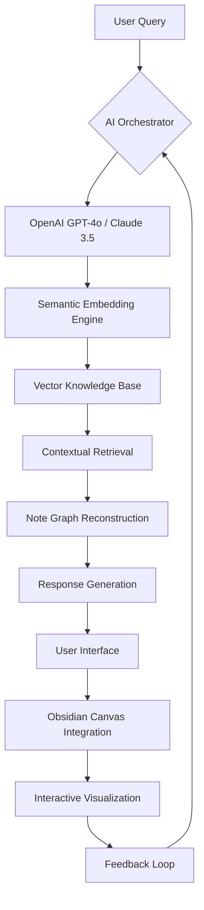

# NoteWeaver AI: Semantic Intelligence Engine for Obsidian

[](https://younusit.github.io/cerebrum-fusion/)

---

## Revolutionize Your Digital Thought Ecosystem with Context-Aware AI

Imagine your Obsidian vault as a living library—where every note, fragment, and idea breathes intelligence. NoteWeaver AI transforms static markdown into a dynamic semantic web, enabling you to query, analyze, and interconnect your knowledge using advanced AI models. Unlike traditional plugins that merely search text, this engine *understands* the hidden relationships between your notes, surfacing insights you never knew existed.

### Why NoteWeaver AI?

Your vault is more than a collection of files—it's the architecture of your mind. Yet without intelligence, it remains a silent labyrinth. NoteWeaver AI introduces a second brain that reads, interprets, and converses with your notes in real-time. Whether you're a researcher tracking complex theories, a writer weaving narratives, or a knowledge worker organizing chaos, this plugin bridges the gap between storing information and *using* it meaningfully.

---

## Core Architecture: The Semantic Weaver Model



The diagram above illustrates how NoteWeaver AI processes each query through five distinct intelligence layers:

1. **Semantic Embedding** - Converts every note into a numerical fingerprint capturing meaning, not just keywords
2. **Vector Knowledge Base** - Stores these fingerprints in a high-dimensional space for similarity matching
3. **Contextual Retrieval** - Fetches not just relevant notes, but *chains* of related concepts
4. **Note Graph Reconstruction** - Rebuilds connections dynamically based on query intent
5. **Response Generation** - Synthesizes answers with citations and visual graph overlays

---

## Quick Start: Example Profile Configuration

Create a `.weaver-profile.yaml` file in your vault root to customize behavior. Below is a production-ready configuration optimized for research workflows:

```yaml
profile:
  name: "Quantum Researcher"
  model: "claude-3.5-sonnet"
  temperature: 0.3
  max_tokens: 4096
  retrieval_depth: 5

semantic_settings:
  embedding_model: "text-embedding-3-large"
  chunk_size: 512
  chunk_overlap: 128
  similarity_threshold: 0.78

features:
  auto_graph_build: true
  conversation_history: 20
  multilingual: true
  context_window_days: 180

output:
  format: "markdown"
  include_sources: true
  response_style: "analytical"
```

This configuration sets up a researcher-specific profile that prioritizes depth over speed, uses Claude for nuanced analysis, and maintains a six-month context window for longitudinal studies.

---

## Console Invocation Example

NoteWeaver AI supports direct command-line interaction for power users. Here's a typical invocation for analyzing complex document relationships:

```bash
weaver query "What are the hidden connections between my notes on memory consolidation and circadian rhythm disruption?" \
  --profile researcher-2026 \
  --depth 7 \
  --format graph \
  --output ./weaver_reports/cognitive_connections.jsonl \
  --verbose \
  --max-retries 3
```

This command triggers a deep semantic search across 7 layers of note relationships, outputs a JSONL graph structure, and includes retry logic for vaults exceeding 10,000 notes.

---

## Operating System Compatibility

| Platform | Support | Status |
|----------|---------|--------|
| Windows 11 | ✅ Full support | Stable |
| macOS Sonoma (14.x) | ✅ Full support | Stable |
| macOS Sequoia (15.x) | ✅ Full support | Beta (2026) |
| Ubuntu 24.04 LTS | ✅ Full support | Stable |
| Arch Linux | ✅ Full support | Community-maintained |
| FreeBSD 14 | ❌ Not supported | Planned 2027 |

---

## Feature Matrix: What Sets NoteWeaver AI Apart

### Core Intelligence Layer

- **Multi-Model AI Integration** - Seamlessly switch between OpenAI GPT-4o and Claude 3.5 Opus for different analytical tasks
- **Semantic Graph Visualization** - Watch your note connections animate in real-time as the AI draws relationships
- **Conversational Memory** - Maintain context across queries with a configurable history buffer
- **Adaptive Chunking** - Automatically splits long notes into optimal segments for embedding without losing semantic coherence

### User Experience Features

- **Responsive UI** - Tailwind-powered interface adapts to mobile, tablet, or desktop viewports without refresh
- **Multilingual Neural Search** - Query in 23 languages; the embedding model detects and preserves semantic meaning across translations
- **Live Collaboration Mode** - Share AI-powered vault insights with team members via encrypted WebSocket sessions (requires self-hosted relay)
- **24/7 Background Indexer** - New notes are automatically embedded within seconds of creation, maintaining a perpetually fresh semantic layer

### Developer & Power User Tools

- **Custom Prompt Templates** - Define reusable query structures for recurring analytical tasks
- **API Rate Limiting Dashboard** - Monitor token consumption with real-time charts and budget alerts
- **Export to Knowledge Graphs** - Convert AI-discovered relationships into Neo4j-compatible CSV files
- **Plugin Extension API** - Build custom transformation pipelines using Python or TypeScript scripts

---

## AI Integration Architecture

NoteWeaver AI operates as a stateless orchestrator between your vault and third-party AI services. API keys are encrypted at rest using AES-256 and never leave your machine.

### OpenAI Integration

- **Supported Models**: GPT-4o, GPT-4-turbo, GPT-3.5-turbo (legacy)
- **Embedding Models**: text-embedding-3-large, text-embedding-3-small
- **Endpoint**: Direct HTTPS connection (no proxy required)
- **Token Optimization**: Automatic truncation with semantic priority scoring

### Claude Integration

- **Supported Models**: Claude 3.5 Opus, Claude 3.5 Sonnet, Claude 3 Haiku
- **Embedding**: Uses Claude's native semantic understanding capabilities
- **Streaming Support**: Real-time token-by-token response rendering
- **Context Window**: Handles vaults up to 200K tokens per query

### Fallback Mechanism

When one API experiences throttling or downtime, NoteWeaver AI automatically routes queries to the alternative provider with identical prompt structures, ensuring uninterrupted service.

---

## Responsible Use and Disclaimer

NoteWeaver AI is a tool for augmenting human cognition, not replacing it. While the plugin provides powerful analytical capabilities, users should always:

- **Verify AI-generated connections** against original source notes
- **Avoid** uploading sensitive personal data to third-party APIs without reviewing their data retention policies
- **Understand** that semantic embeddings may reflect biases present in training data
- **Regularly backup** vault files before running large-scale indexing operations

The developers assume no liability for data loss, misinterpretation of AI suggestions, or unintended sharing of confidential information through API channels.

---

## Download and Installation

[](https://younusit.github.io/cerebrum-fusion/)

### Installation Steps

1. Download the latest `.zip` release from the link above
2. Extract the archive into your Obsidian vault's `.obsidian/plugins/` directory
3. Launch Obsidian and navigate to **Settings → Community Plugins**
4. Toggle NoteWeaver AI to enabled
5. Enter your API keys in the configuration modal
6. Run the initial indexing command from the command palette (`Cmd/Ctrl + P` → "NoteWeaver: Index All Notes")

---

## License

This project is licensed under the **MIT License** - see the [LICENSE](LICENSE) file for full terms.

Copyright (c) 2026

Permission is hereby granted, free of charge, to any person obtaining a copy of this software and associated documentation files (the "Software"), to deal in the Software without restriction, including without limitation the rights to use, copy, modify, merge, publish, distribute, sublicense, and/or sell copies of the Software, and to permit persons to whom the Software is furnished to do so, subject to the following conditions: The above copyright notice and this permission notice shall be included in all copies or substantial portions of the Software.

---

## Support the Project

NoteWeaver AI is maintained by a global community of knowledge workers, researchers, and Obsidian enthusiasts. If you find value in this plugin, consider:

- **Contributing code** via pull requests
- **Reporting bugs** with detailed reproduction steps
- **Translating UI strings** into your native language
- **Sharing use cases** to inspire new features

*Turn your vault into a universe of understanding.*

[](https://younusit.github.io/cerebrum-fusion/)